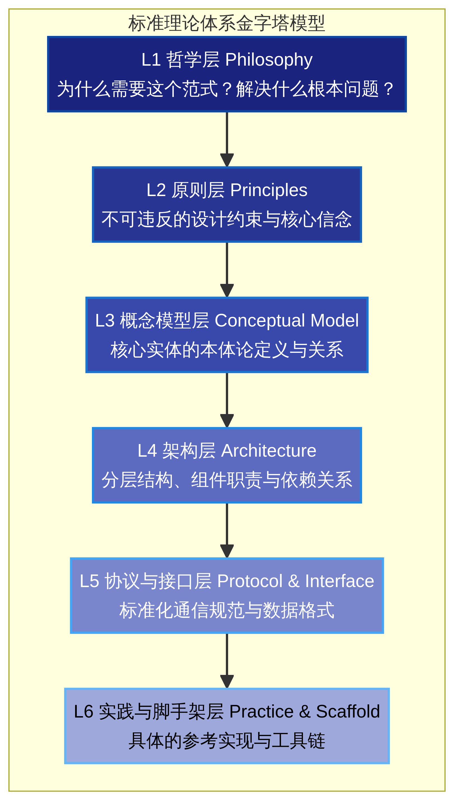
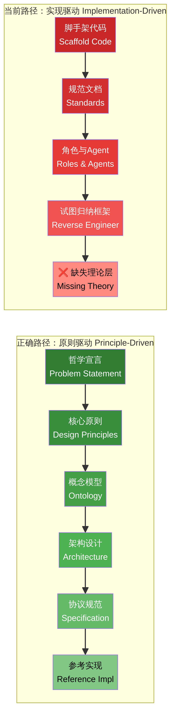

# 从实践到理论：AI原生开发范式的标准理论框架重构分析报告

## 1. 引言：从“结果导向”到“框架驱动”的认知转变

当前，在探索“AI原生开发范式”的过程中，我们陷入了一个常见的工程陷阱：**先有脚手架和实践结果，随后试图从中归纳出框架**。正如您所指出的，目前的“AI原生开发范式V1”本质上是一套可供直接使用的企业级脚手架和开发流程规范，它在具体方案和实际操作层面提供了详实的指导。然而，在上层抽象层面，即框架、协议、本体论和核心设计哲学上，它是严重缺失的。

在软件工程和技术标准的演进史上，成功的标准协议与框架往往遵循**“先有理论框架，再输出实践结果”**的路径。理论框架确立了不可妥协的设计底线和通用语言，而具体的脚手架、工具链和规范只是该理论在特定技术栈下的**参考实现**。本文将深入对标业界成熟的标准协议与架构框架（如 12-Factor App、MCP 协议、Clean Architecture、TOGAF 等），诊断当前 V1 版本的结构性缺失，并重构出一个真正的 AI 原生开发范式应有的理论体系结构。

## 2. 业界成熟标准协议与框架的构建方法论

通过对业界具有深远影响力的技术标准和框架进行深入研究，我们发现它们在构建方法论上具有高度的一致性。它们无一例外地采用了一种自顶向下的**"标准理论体系金字塔模型"**。该模型从抽象到具体，依次包含哲学层、原则层、概念模型层、架构层、协议层，最后才是实现层。

以下是几个典型案例的构建路径分析：

| 标准/框架名称 | 核心哲学与问题定义 | 原则层（不可违反的约束） | 概念模型与架构层 | 实践输出形式 |
| :--- | :--- | :--- | :--- | :--- |
| **12-Factor App** [1] | 解决 SaaS 应用开发中的系统性问题，提供共享词汇。 | 提炼出 12 条独立于语言和平台的原则（如“配置存储在环境中”）。 | 将应用抽象为代码库、依赖、配置、后端服务等要素。 | 纯理论的方法论宣言，无绑定代码。 |
| **Model Context Protocol (MCP)** [2] | 解决 LLM 与外部数据源和工具安全集成的标准化问题。 | 1. Server 应极易构建；2. 高度可组合；3. 严格的上下文隔离。 | 提出 Host-Client-Server 的三层架构模型。 | 基于 JSON-RPC 的通信规范和开源参考实现。 |
| **Clean Architecture** [3] | 解决软件系统与外部框架、数据库高度耦合导致的不可测试问题。 | **依赖规则（The Dependency Rule）**：源码依赖只能向内指向高级策略。 | 划分实体、用例、接口适配器、框架与驱动四层同心圆。 | 架构概念图与跨边界数据传递规范。 |
| **TOGAF ADM** [4] | 解决企业架构在复杂组织中无法有效指导变革的问题。 | 强调先建立框架和原则（Preliminary Phase）。 | 将架构划分为业务、数据、应用、技术四个抽象领域。 | 作为信息流模型的架构开发方法（ADM）。 |

这些案例共同揭示了一个核心规律：**成熟的标准框架是从对问题域的深刻洞察出发，提炼出抽象的约束原则，进而定义组件间的关系模型，最后才涉及具体的实现工具。**

### 2.1 案例深入分析：12-Factor App 的构建逻辑

12-Factor App 是理解"原则驱动"方法论的经典样本。它的创始人 Adam Wiggins 并未提供任何一行代码或具体的工具链，而是先明确定义了问题域："在现代软件即服务（SaaS）的开发中，存在哪些系统性的、反复出现的问题？"。然后，他将解决方案抽象为 12 条独立于语言和平台的原则，每条原则都是一个约束而非一个工具。例如，"配置存储在环境中"这条原则不会告诉你用 `.env` 文件还是 Kubernetes ConfigMap，它只是约束了"配置不应硬编码在代码中"这一不可越越的边界。正因如此，十多年后的今天，无论技术栈如何变迁，12-Factor 的原则依然有效。Google 甚至在其基础上扩展出了针对 AI 应用的第 13—16 条原则 [5]，这正是理论框架具备长期生命力的最佳体现。

### 2.2 案例深入分析：MCP 协议的架构设计

Anthropic 提出的 Model Context Protocol (MCP) [2] 是 AI 时代协议设计的标杆。它的构建路径是：首先定义了三条核心设计原则（Server 应极易构建、高度可组合、严格的上下文隔离），然后建立了 Host-Client-Server 的三层概念模型，明确定义了每个角色的职责边界（Host 控制安全策略、Client 维护与 Server 的 1:1 连接、Server 暴露能力）。在概念模型确立之后，才进入协议层选择了 JSON-RPC 2.0 作为通信基础。整个过程中，没有任何一步是从具体代码出发的。

### 2.3 案例深入分析：Clean Architecture 的统治性规则

Robert C. Martin 的 Clean Architecture [3] 则展示了另一种极致：用**一条规则**统治整个架构。他先综合了 Hexagonal Architecture、Onion Architecture、Screaming Architecture 等多种架构思想，提炼出一条核心的"依赖规则（The Dependency Rule）"：源码依赖只能向内指向。然后，他基于这条规则推导出四层同心圆架构（实体、用例、接口适配器、框架与驱动），并明确指出"层数不是固定的，但依赖规则始终适用"。这种"一条规则 + 可扩展分层"的设计，使得 Clean Architecture 能够适用于从嵌入式系统到微服务的几乎所有场景。

### 2.4 案例深入分析：DDD 的战略与战术分离

Eric Evans 的领域驱动设计（DDD）提供了另一个重要启示：理论框架应当明确区分**战略设计（Strategic Design）**和**战术设计（Tactical Design）**。战略层定义了 Bounded Context（限界上下文）、Ubiquitous Language（统一语言）、Context Map（上下文映射）等抽象概念，这些概念不涉及任何代码实现；战术层才引入 Entity、Value Object、Aggregate 等具体的实现模式。这种分离确保了理论的普适性：即使你不使用 DDD 的战术模式，战略层的思想仍然能指导你的架构决策。

## 3. AI原生开发范式V1的现状诊断

目前的“AI原生开发范式V1”提供了一条命令初始化企业级项目的能力，内置了 7 个角色、11 个核心 Agent、23 个 Skill 技能库以及 9 大业务流程。从工程实践的角度来看，这是一个优秀的脚手架工具。但在理论框架层面，它存在以下显著的结构性缺失：

**第一，缺乏哲学宣言与问题定义。** V1 版本直接切入“是什么”和“怎么用”，却没有清晰地阐述它要解决的根本性行业问题是什么。它缺乏类似于 12-Factor App 那样的动机声明，没有解释在 AI 时代传统的软件工程面临了哪些旧方法无法解决的新挑战。

**第二，缺乏核心设计原则（Principles）。** 框架的灵魂在于约束。Clean Architecture 有“依赖规则”，MCP 有“上下文隔离”原则，而 V1 版本仅仅是组件的堆砌，没有提炼出指导整个范式演进的、不可违反的设计底线。

**第三，缺乏概念模型与本体论（Ontology）。** V1 版本直接给出了前端、后端、测试等具体角色，以及代码规范、Git 规范等具体要求，但没有在抽象层面定义什么是“Agent”、什么是“Skill”、什么是“Handoff（交接）”，以及它们之间的数学或逻辑关系。这种缺乏本体论的设计，使得框架难以泛化到非软件开发的其他 AI 协同场景。

**第四，将线性流程误等同于架构体系。** V1 版本提出了“9 大业务流程”（产品分析 → 技术架构 → 代码开发等），这本质上是传统的软件开发生命周期（SDLC）的流水线映射，而不是系统的架构抽象。真正的架构应该像 TOGAF 或 Clean Architecture 那样，描述的是组件职责与依赖关系，而非单纯的时间序列。

**第五，倒置的构建路径：实现驱动（Implementation-Driven）。** 这是最致命的问题。我们是先写出了代码、造出了脚手架，然后试图把这些具体的产物包装成一个"范式"。这导致该范式与特定的技术栈、特定的工具链深度绑定，失去了作为"标准协议"应有的普适性和生命力。

下图直观地对比了"实现驱动"与"原则驱动"两种截然不同的构建路径，清晰地展示了当前 V1 版本所处的位置及其应当转向的方向：

## 4. 重构：AI原生开发范式应有的理论体系结构

为了将“AI原生开发范式”提升为真正的行业标准，我们必须抛弃现有的脚手架结果，重新从零开始构建其理论体系。参考业界成熟方法论，我们提出以下六层理论架构：

### L1 哲学层 (Philosophy)
必须明确 AI 原生开发的本质。这不仅是“用 AI 写代码”，而是**“从指令驱动到意图驱动的范式转移”**。其核心哲学应包含：人机协同的边界重构、智能作为第一类系统公民、以及规范即代码（Specification as Code）。

### L2 原则层 (Principles)
参考 Google 对 12-Factor 的 AI 扩展（16-Factor App）[5]，AI 原生开发范式需要确立自己的核心原则，例如：
*   **提示词即代码（Prompts as Code）**：提示词、上下文工程逻辑和行为规范必须被版本化和测试化。
*   **状态外部化（State as a Service）**：Agent 必须是无状态的，对话记忆和长期知识必须作为外部支撑服务。
*   **非确定性可观测（Observability for Non-determinism）**：监控不仅针对系统健康，必须涵盖 AI 的输出质量、Token 消耗和工具调用准确率。
*   **信任与安全内建（Trust & Safety by Design）**：基于最小权限原则，严格限制 Agent 对外部工具和底层 API 的访问。

### L3 概念模型层 (Conceptual Model)
在这一层，需要建立 AI 原生开发的本体论（Ontology）。脱离具体的“前端开发”或“测试工程师”标签，定义抽象的实体：
*   **意图（Intent）**：系统目标的声明式描述。
*   **智能体（Agent）**：具备特定上下文和推理能力的自治单元。
*   **技能（Skill/Tool）**：智能体与外部世界交互的原子化能力。
*   **交接（Handoff）**：智能体之间或人机之间转移上下文与控制权的标准契约。

### L4 架构层 (Architecture)
摒弃线性的业务流程，构建分层的 AI 协同架构。例如：
*   **意图解析层**：负责将人类的模糊需求转化为结构化的系统规范。
*   **Agent 编排层**：负责多智能体的任务拆解、路由与生命周期管理。
*   **工具执行层**：提供沙箱化的技能执行环境。
*   **基础设施层**：提供模型路由、向量存储、可观测性等基础服务。

### L5 协议与接口层 (Protocol & Interface)
定义标准的通信协议。例如，参考 Google 的 A2A (Agent-to-Agent) 协议 [6] 或 Anthropic 的 MCP 协议 [2]，制定不同 Agent 之间交换状态、传递上下文的标准 JSON Schema，使得基于该范式开发的 Agent 能够跨平台互操作。

### L6 实践与脚手架层 (Practice & Scaffold)
在上述所有理论框架确立之后，当前的 V1 版本脚手架才应该作为该理论框架的**"官方参考实现之一"**登场。它证明了这套理论在特定企业级场景下是可落地的。

下表将上述六层理论架构与 V1 版本的现状进行了逐层对照，清晰地展示了每一层的缺失情况及其应当包含的内容：

| 理论层级 | V1 现状 | 应当包含的内容 | 业界对标 |
| :--- | :--- | :--- | :--- |
| **L1 哲学层** | ✗ 完全缺失 | 问题定义、范式存在的必要性论证、适用边界声明 | 12-Factor 的背景宣言 |
| **L2 原则层** | ✗ 完全缺失 | 不可越越的设计约束（如"提示词即代码"、"状态外部化"） | Clean Architecture 的依赖规则 |
| **L3 概念模型层** | △ 隐含但未显式定义 | Agent、Skill、Intent、Handoff 的本体论定义与关系图 | MCP 的 Host-Client-Server 模型 |
| **L4 架构层** | △ 以线性流程替代 | 分层架构（意图解析、Agent编排、工具执行、基础设施） | TOGAF 的四层架构 |
| **L5 协议层** | ✗ 完全缺失 | Agent 间通信规范、上下文传递的 JSON Schema | MCP 的 JSON-RPC 规范 |
| **L6 实践层** | ✓ 已完成 | 企业级脚手架、角色定义、规范文档 | 各框架的参考实现 |

## 5. 实施路径：如何实现“先有理论框架，再输出实践结果”

要纠正目前"走偏"的路线，建议采取以下四个阶段的实施路径。每个阶段都有明确的交付物和验收标准：

**阶段一：抽离与升华（Abstraction）。** 暂时放下现有的代码库，从现有的脚手架中反向提取核心概念，剥离所有与具体语言（如 Python、TypeScript）和具体工具（如 Docker、K8s）相关的细节，只保留纯粹的逻辑关系。交付物是一份纯文字的"概念词典"，定义每个核心术语的含义和边界。

**阶段二：原则确立与白皮书撰写（Whitepaper）。** 模仿 12-Factor App 的格式，撰写《AI 原生开发范式宣言》白皮书。在这份文档中，不应出现任何一行具体的实现代码，只谈理念、原则和架构模型。验收标准是：一个不了解任何具体工具的人，仅通过阅读白皮书就能理解这套范式的核心思想。

**阶段三：协议规范化（Specification）。** 为 Agent 之间的交互、上下文的传递编写严格的协议规范（如 OpenAPI 格式或 JSON Schema），这构成了该范式的"标准"。协议规范应当像 MCP 那样，具备明确的版本号、能力协商机制和向后兼容承诺。

**阶段四：参考实现降级（Reference Implementation）。** 将目前的 V1 脚手架重新定位。它不再等同于"范式"本身，而是被定义为："基于 AI 原生开发范式理论构建的、面向 Java/Python 生态的企业级参考脚手架"。这种重新定位不仅不会贬低 V1 的价值，反而会让它在更大的理论体系中找到正确的位置，并且允许其他团队基于同一套理论框架构建自己的参考实现。

## 6. 结论

一个缺乏上层理论抽象的技术产物，充其量只是一个好用的工具，而无法成为引领行业的“范式”或“标准”。通过对标 12-Factor App、MCP、Clean Architecture 等业界成熟标准，我们清晰地看到，真正的标准构建必须遵循**“哲学 → 原则 → 模型 → 架构 → 协议 → 实现”**的自顶向下路径。

将现有的脚手架经验升华为纯粹的理论框架，不仅能解决当前范式与具体技术栈过度耦合的问题，更是确保“AI原生开发范式”具备长期演进能力、能够跨越不同平台和生态的关键所在。先确立理论框架，再让实践结果自然生长，这才是建立行业标准的必由之路。

## 7. 参考文献

[1] The Twelve-Factor App. https://12factor.net/
[2] Model Context Protocol Specification. https://modelcontextprotocol.io/specification/2025-06-18/architecture
[3] Robert C. Martin. The Clean Architecture. https://blog.cleancoder.com/uncle-bob/2012/08/13/the-clean-architecture.html
[4] TOGAF Architecture Development Method Phases Explained. https://conexiam.com/togaf-adm-phases-explained/
[5] Google Cloud. Rethinking the Twelve-Factor App framework for AI. https://cloud.google.com/transform/from-the-twelve-to-sixteen-factor-app
[6] Google Developers. Announcing the Agent2Agent Protocol (A2A). https://developers.googleblog.com/en/a2a-a-new-era-of-agent-interoperability/
